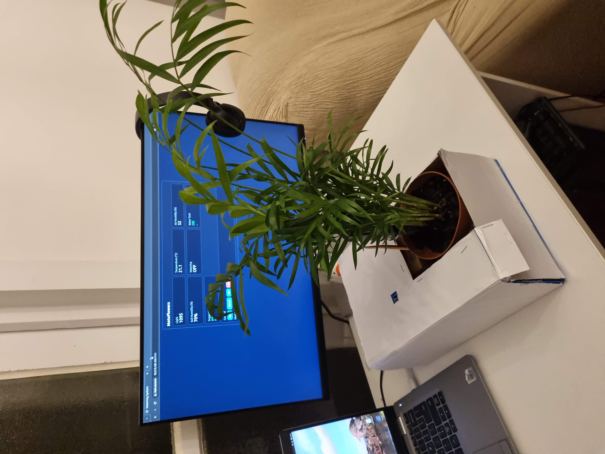
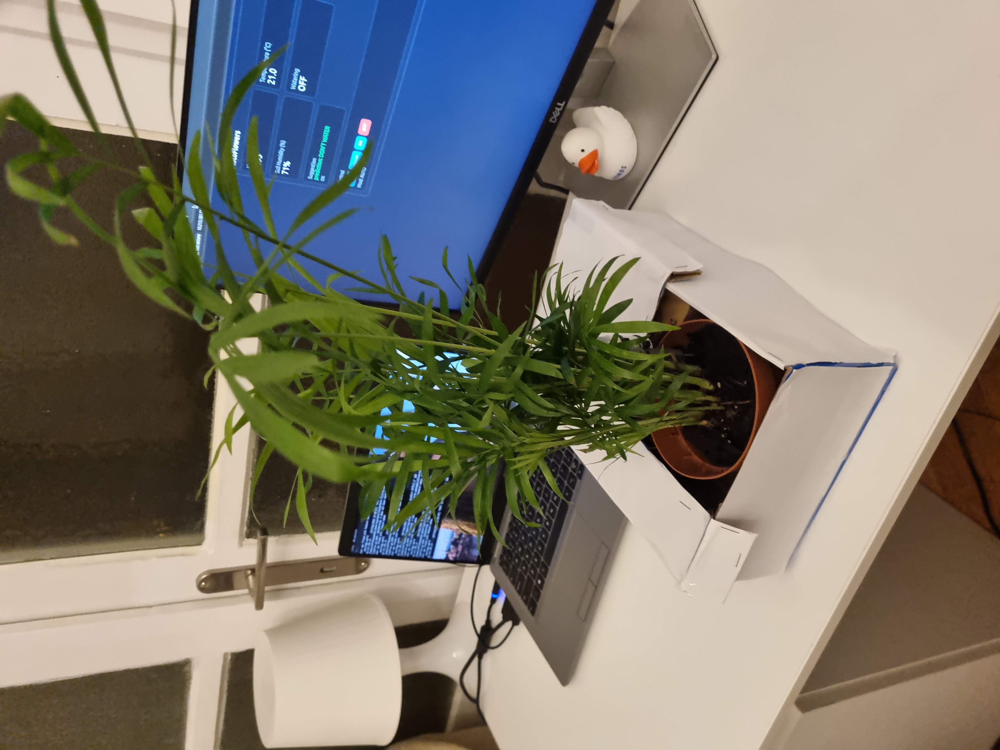
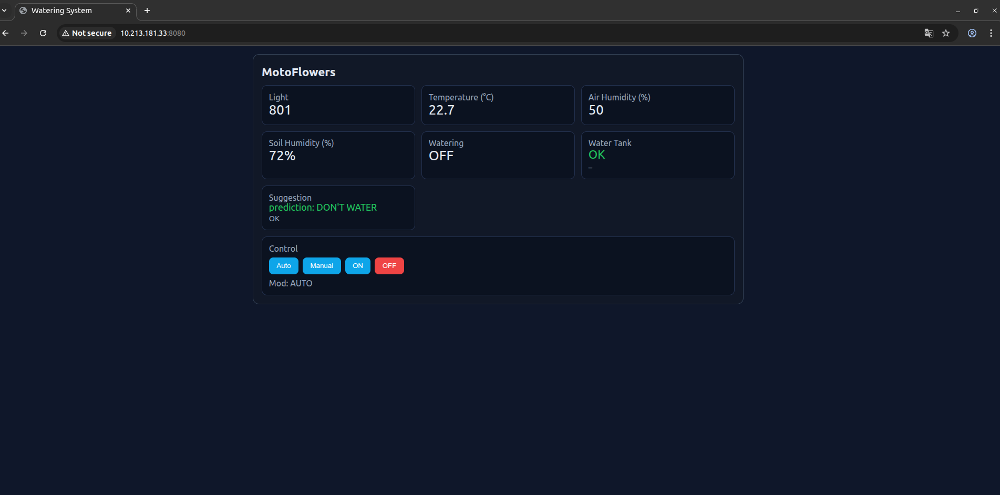
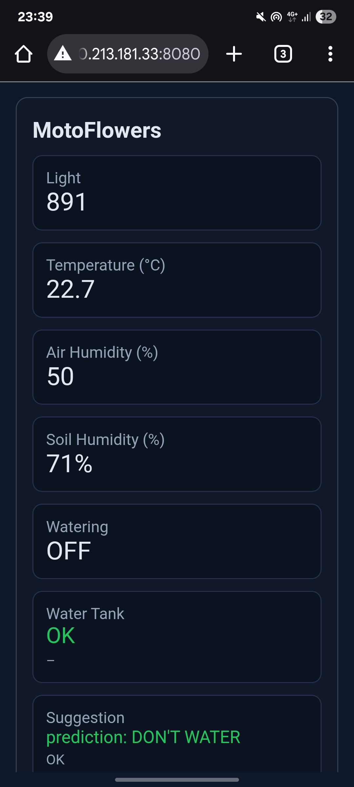
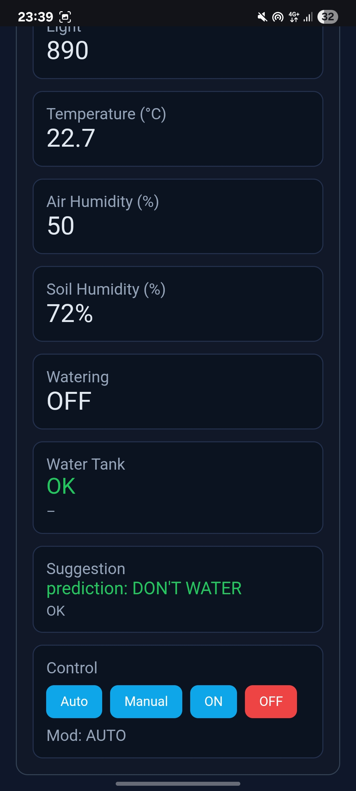

# AutomatedWateringPlant
`
## Description
An intelligent automated plant watering system that uses **machine learning** to decide when plants need water. The system monitors environmental conditions (temperature, humidity, light, soil moisture) via sensors connected to an **ESP32 microcontroller**, sends the data to a **Raspberry Pi Zero** running a Flask API with a **TensorFlow Lite ML model**, and automatically activates watering based on predictions. 

The system features a **responsive web interface** accessible from any device for real-time monitoring and manual control, with automatic/manual mode switching and safety protections.

## Bill of Materials

### Electronics
- **ESP32** microcontroller (WiFi-enabled)
- **Raspberry Pi Zero** (runs ML model and Flask API server)
- **DHT11 sensor** - Temperature and air humidity measurement
- **Capacitive soil moisture sensor** - Monitors soil moisture levels
- **LDR (Light Dependent Resistor)** - Detects ambient light intensity
- **Water level sensor** - Monitors water reservoir status
- **Water pump** - Activates watering
- **Relay module** - Controls 12V pump from ESP32 (5V/3.3V signal)

### Additional Materials
- Plant pot
- Soil
- Plant
- Water reservoir/container
- Tubing for water delivery
- Power supply
- Jumper wires and breadboard

## Features

### Key Functionality
- **Machine Learning Predictions**: TensorFlow Lite model optimized for Raspberry Pi Zero (ARMv6)
- **Real-time Sensor Monitoring**: Temperature, humidity, light, and soil moisture
- **Automatic Watering**: Based on ML predictions or light-based fallback logic
- **Web Dashboard**: Responsive interface accessible from phone/computer
- **Manual/Auto Modes**: Complete control with manual override capability
- **Safety Features**: Water level monitoring prevents pump dry-running
- **WiFi Communication**: ESP32 ↔ Raspberry Pi via HTTP/REST API

### Operating Modes

**AUTO Mode:**
- Continuously reads all sensors every second
- Sends environmental data to Flask ML API every 5 seconds
- Receives ML prediction for watering decision
- Falls back to light-based logic if ML unavailable
- Automatic watering activation when conditions met
- Water tank safety protection always active

**MANUAL Mode:**
- Direct control via web interface
- Override automatic decisions
- Still respects water tank safety (won't run pump if tank empty)
- Real-time sensor data display

## System Architecture

### Component Communication Flow
```
┌─────────────┐      WiFi/HTTP       ┌──────────────────┐
│   ESP32     │ ──────────────────>  │  Raspberry Pi    │
│             │   POST /predict      │  Flask API       │
│  - DHT11    │                      │  + ML Model      │
│  - LDR      │ <────────────────── │  (TFLite)        │
│  - Soil     │   JSON Response      │                  │
│  - Water    │                      │                  │
│  - Pump     │                      │                  │
└─────────────┘                      └──────────────────┘
      ↑                                       
      │                                       
  ┌───┴────┐                                 
  │ Web UI │  (Hosted on ESP32, port 8080)   
  └────────┘                                 
```

### Data Flow
1. **ESP32** reads sensors (temperature, humidity, light, soil moisture, water level)
2. **ESP32** sends data to **Raspberry Pi** `/predict` endpoint via HTTP POST
3. **Raspberry Pi** normalizes data using saved scaler
4. **TFLite model** runs inference and returns prediction
5. **ESP32** receives decision (`should_water: true/false`)
6. **ESP32** activates/deactivates pump (with safety checks)
7. **Web interface** displays real-time status and allows manual control

## Project Structure

```
AutomatedWateringPlant/
│
├── ESP32_Code/
│   └── Automate_Watering.ino       # ESP32 firmware (sensors + web server)
│
├── Raspberry_Pi_Code/
│   ├── app.py                      # Flask API with ML inference
│   ├── udare_model.tflite          # TensorFlow Lite model (optimized)
│   ├── scaler.pkl                  # Feature normalization scaler
│   ├── setup_pi.sh                 # Automated setup script
│   └── start_api.sh                # API startup script
│
├── Train_Code/
│   ├── train.py                    # ML model training script
│   └── water_data.csv              # Training dataset (103 samples)
│
├── photos/                         # Project photos and diagrams
│
├── README.md                       # This file
└── PROJECT_VERIFICATION.md         # Technical verification report
```

## Setup Instructions

### 1. Train the ML Model (on Laptop/PC)

```bash
cd Train_Code/
python train.py
```

**Outputs:**
- `udare_model.tflite` - Optimized model for Raspberry Pi
- `scaler.pkl` - Feature normalization scaler
- `udare_model.h5` - Full Keras model (optional)

### 2. Setup Raspberry Pi Zero

```bash
cd Raspberry_Pi_Code/

# Copy model files from training
cp ../Train_Code/udare_model.tflite .
cp ../Train_Code/scaler.pkl .

# Run automated setup (installs dependencies, creates venv)
bash setup_pi.sh

# Start the API server
bash start_api.sh
```

**API will be accessible at:** `http://<raspberry-pi-ip>:5000`

**Endpoints:**
- `GET /` - Status information
- `GET /health` - Health check
- `POST /predict` - ML prediction endpoint
- `POST /batch_predict` - Batch predictions

### 3. Configure and Upload ESP32 Code

1. Open `ESP32_Code/Automate_Watering.ino` in Arduino IDE
2. Update WiFi credentials:
   ```cpp
   const char* wifiSsid = "YOUR_WIFI_SSID";
   const char* wifiPassword = "YOUR_WIFI_PASSWORD";
   ```
3. Update Raspberry Pi IP address:
   ```cpp
   const char* apiHost = "192.168.1.XXX";  // Your Pi's IP
   ```
4. Upload to ESP32

### 4. Access Web Interface

After ESP32 boots and connects to WiFi:
- Check serial monitor for IP address
- Navigate to: `http://<esp32-ip>:8080`
- View real-time sensor data
- Switch between AUTO/MANUAL modes
- Control watering manually

## Hardware Connections

### ESP32 Pin Configuration
```
DHT11 DATA    → GPIO 4
LDR           → GPIO 34 (ADC1_CH6)
Soil Sensor   → GPIO 35 (ADC1_CH7)
Water Level   → GPIO 36 (ADC1_CH0)
Pump Relay    → GPIO 25
```

### Sensor Calibration (in code)
```cpp
int ldrThresh   = 800;   // Light threshold for watering
int soilDry     = 3000;  // ADC value when soil is dry
int soilWet     = 1200;  // ADC value when soil is wet
int waterThresh = 300;   // Water level threshold
```

## API Reference

### POST /predict

**Request:**
```json
{
  "temperature": 25.5,
  "air_humidity": 45.0,
  "luminosity": 800.0
}
```

**Response:**
```json
{
  "should_water": true,
  "probability": 0.87,
  "input": {
    "temperature": 25.5,
    "air_humidity": 45.0,
    "luminosity": 800.0
  }
}
```

## Questions

### Q1 - What is the system boundary?
The **ESP32 microcontroller** controls the water pump and gathers sensor information (temperature, humidity, light, soil moisture, water level). It sends this data to a **Raspberry Pi Zero server** where ML inference happens via a Flask API. The system includes a **web interface** hosted on the ESP32 for monitoring and manual control, accessible from any device on the same network.

### Q2 - Where does intelligence live?
The intelligence is distributed:
- **ESP32**: Sensor reading, water level safety logic, web server, fallback light-based logic
- **Raspberry Pi**: ML model inference (TensorFlow Lite), data normalization, prediction logic
- The **primary intelligence** (ML decision-making) resides on the Raspberry Pi

### Q3 - What is the hardest technical problem?
1. **Solved:** Building and optimizing ML model - Implemented neural network with TensorFlow Lite conversion for Raspberry Pi Zero (ARMv6) compatibility
2. **Solved:** Watering the plant - Wanted to use a solenoid valve, but I got a better idea of using a small water pump

### Q4 - What is the minimum demo?
**Achieved and exceeded:**
- Water pump activation/deactivation via web interface ✓
- Real-time sensor monitoring on web dashboard ✓
- AUTO mode with ML-based watering decisions ✓
- MANUAL mode for direct user control ✓
- Water tank level monitoring with safety protection ✓
- Responsive web UI accessible from phone/computer ✓

### Q5 - Why is this not just a tutorial?
This is a complete **original implementation** featuring:
- **Custom ML model** trained on collected environmental data
- **TensorFlow Lite optimization** specifically for Raspberry Pi Zero ARMv6
- **Original web interface** with real-time updates and dual mode operation
- **Safety features**: Water level monitoring, pump dry-run protection
- **Fallback logic**: System continues working even if ML API is unavailable
- **Complete integration** of hardware, firmware, ML backend, and web frontend
- **Production-ready** with automated setup scripts and error handling

This is a **marketable MVP** - a complete IoT + ML product, not a tutorial project.

### Q6 - Do I need an ESP32?
**Yes, ESP32 is used** for its:
- Built-in WiFi capability (essential for API communication)
- Multiple ADC pins for sensors (ESP8266 has only one)
- Sufficient processing power for web server + sensor management
- Better Arduino library support and stability

## Technologies Used

- **Hardware**: ESP32, Raspberry Pi Zero, DHT11, capacitive sensors, relay
- **Firmware**: C++ (Arduino framework)
- **Backend**: Python, Flask, TensorFlow Lite, NumPy, scikit-learn
- **ML Model**: Neural Network (Sequential: Dense layers with ReLU/Sigmoid)
- **Frontend**: HTML5, CSS3, JavaScript (Vanilla)
- **Protocols**: HTTP/REST, JSON, WiFi
- **Optimization**: TFLite for ARM, MinMax scaling, float32 precision

## Photos

### Hardware Setup



### Web Dashboard


### Phone Dashboard



## Video
[Automated Watering Plant Demo](https://youtu.be/XNLnl4KjuUw)

## Conclusion

**AutomatedWateringPlant** is a complete end-to-end IoT + Machine Learning system that demonstrates how intelligent decision-making can be embedded into real-world hardware projects.

This project goes beyond basic automation by:
- Integrating **machine learning inference** on edge hardware
- Ensuring **fault tolerance** through fallback logic
- Providing **real-time visibility and control** via a web interface
- Implementing **hardware safety protections**
- Maintaining a clean, modular, and production-ready architecture

The system is fully functional, extensible, and suitable as a foundation for a commercial smart agriculture or smart home product.

---